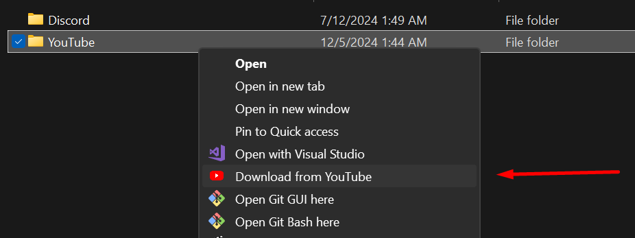
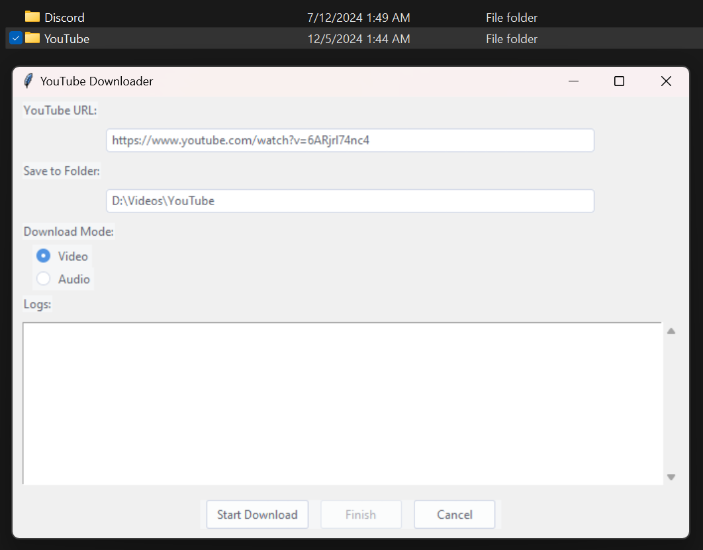

# YouTube Downloader with Context Menu Integration

<!--  -->

A handy Python application that allows you to download YouTube videos or audios directly from your Windows context menu. Simply right-click inside any folder and choose to download from YouTube.

Download YouTube videos directly from the context menu:



Simple and direct window for downloading and following logs:



## **Features**

- **Easy Download**: Download YouTube videos or audios with a simple right-click.
- **GUI Interface**: User-friendly GUI for inputting URLs and monitoring download progress.
- **High-Quality Downloads**: Downloads the highest available quality using `pytube` and `ffmpeg`.
- **Context Menu Integration**: Seamlessly integrated into Windows Explorer for quick access.

## **Prerequisites**

- **Python 3.6 or higher**: Ensure Python is installed and added to your system `PATH`.
- **`pip` Package Manager**: Comes with Python installations.
- **`ffmpeg`**: Download and install from [ffmpeg.org](https://ffmpeg.org/), and add it to your system `PATH`.

## **Installation**

1. **Clone the Repository:**

   ```bash
   git clone https://github.com/tornellihenrique/youtube-downloader.git
   ```

2. **Navigate to the Project Directory:**

   ```bash
   cd youtube-downloader
   ```

3. **Install Dependencies:**

   ```bash
   pip install -r requirements.txt
   ```

   **Note**: If you encounter permissions issues, you may need to run the command as an administrator or use a virtual environment.

4. **Install `ffmpeg`:**

   - Download from [ffmpeg.org](https://ffmpeg.org/download.html).
   - Add the `ffmpeg/bin` folder to your system `PATH`.

5. **Set Up Context Menu Integration:**

   - Right-click on `setup_registry.bat` and select **Run as administrator**.
   - Confirm any prompts to allow the script to modify the registry.

## **Usage**

1. **Copy a YouTube URL** to your clipboard.

2. **Right-click** inside any folder or on a folder in Windows Explorer.

3. Select **"Download from YouTube"** from the context menu.

4. The GUI will appear with the URL and save location pre-filled.

5. **Choose** between downloading **Video** or **Audio**.

6. Click **"Start Download"** and monitor progress in the logs.

7. Once complete, the downloaded file will be saved in the selected folder.

## **Project Structure**

```
youtube-downloader/
│
├── youtube_downloader.pyw    # Main application script
├── youtube_icon.ico          # Icon for context menu
├── setup_registry.bat        # Batch script to set up registry entries
├── requirements.txt          # Python dependencies
├── README.md                 # Project documentation
└── LICENSE                   # License file
```

## **Contributing**

Contributions are welcome! Please open an issue or submit a pull request for any improvements.

## **License**

This project is licensed under the MIT License - see the [LICENSE](LICENSE) file for details.

## **Acknowledgments**

- [pytube](https://pytube.io/) - For handling YouTube downloads.
- [ffmpeg](https://ffmpeg.org/) - For processing video and audio streams.
- [ttkthemes](https://github.com/RedFantom/ttkthemes) - For theming the GUI.